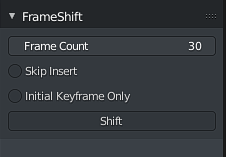

# FrameShift

Blender addon to aid keyframe manipulation in the middle of an existing animation.

## Installation

- [Click here to go to the latest](https://github.com/rmp135/frameshift/releases/latest).
- Click **Source Code (zip)**
- Open Blender
  - Edit -> Preferences -> Install... and select the downloaded zip file.
  - Tick the box to enable.

## Usage

In the Dope Sheet, Timeline and F-Curve views a new side panel item will be available.

### Shift

Moves keyframes of the selected object that are after the cursor position forward by a number of frames.

- Frame Count - Moves subsequent frames forward by this number of frames.
- Insert Keyframes At - Where to insert (if any) keyframes.
  - Start and End - At the cursor position and at end of the frame shift.
  - Start - At the cursor position only.
  - None - Do not insert keyframes, only move existing ones.
- Shift - Performs the shift operation.

### Repeat

Repeats the selected number of keyframes after one another, shifting future keyframes to make room.

- Repeat Offset - The number of frames to space apart the repeats.
- Repeat Count - Number of times to repeat by.
- Repeat - Performs the repeat operation.

### Merge

Merges the selected keyframes. Useful for aligning multiple object animations to a set position. This is essentially the same operation as scaling the frames by 0.

- First - Merges at the earliest selected keyframe.
- Center - Merges at the center point of selected keyframes.
- Last  - Merges at the latest selected keyframe.
- Cusor - Merges at the current cursor position.

## Considerations

This was not tested with, and will likely not function correctly for NLA animations.

For large animations, or complex armatures, Blender may lock up for a few seconds while it inserts the keyframes. 
