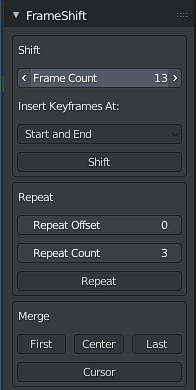

# FrameShift

Blender addon to aid inserting keyframes in the middle of an existing animation.

## Installation

- Click Code -> Download ZIP
- Open Blender
  - Edit -> Preferences -> Install... and select the downloaded zip file.
  - Tick the box to enable.

## Usage

In the Dope Sheet, Timeline and F-Curve views a new side panel item will be available.

Select the objects you would like the shift. 

By default, clicking "Shift" will insert a keyframe at the current location, and a duplicate keyframe the set number of frames forward, essentially freezing the animation in place for editing. 

This behaviour can be changed with the following options.

**Frame Count**

The number of frames to shift the animation by.

**Skip Insert**

Skips keyframe insertion entirely and just moves the existing keyframes.

**Initial Keyframe Only**

Inserts the initial keyframes only, skipping the ending keyframes.

## Considerations

This was not tested with, and will likely not function correctly for NLA animations.

For large animations, or complex armatures, Blender may lock up for a few seconds while it inserts the keyframes. 
